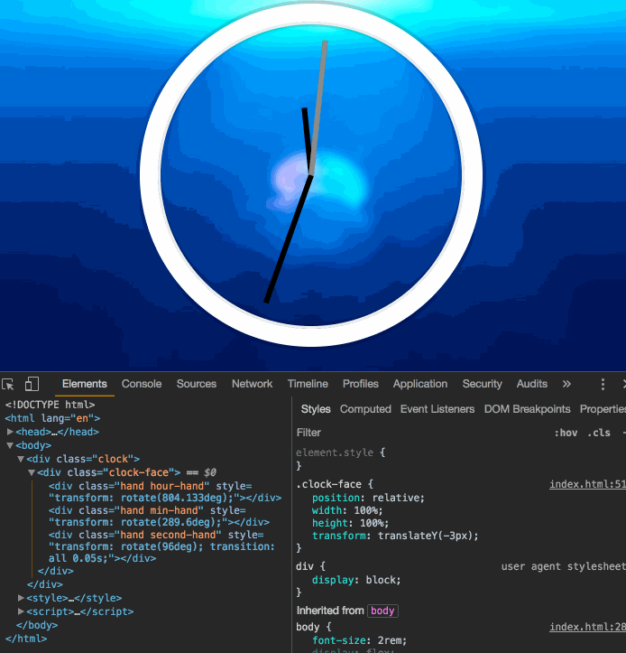

# Objective
利用 CSS 和 JS 实现一个时钟界面，每秒更新三个指针的位置。

# Steps
## CSS 部分
1. 设置指针旋转的原点`transform-origin: right;`
2. 设置 CSS transition 模拟时钟指针抖动；
3. 添加 CSS 样式区别时针秒针。

## JS 部分
1. 获取 Date 对象得到时间并计算需要转动的角度；
2. 设置三个指针的 transform 属性为 `rotate(${xxxDegree}deg)`；
3. 在转动角度归零(90deg)时特殊处理 transition。

## 最终效果

> [online demo](https://xg-wang.github.io/JavaScript30/02%20-%20JS%20+%20CSS%20Clock)

# Things learned
## CSS tranform
[MDN document](https://developer.mozilla.org/en-US/docs/Web/CSS/transform)
通过设置 `transform` 为 `translateX/Y` 进行平移，`rotate` 进行旋转，`transform-origin` 指定旋转的圆心。

[transform function](https://developer.mozilla.org/en-US/docs/Web/CSS/transform-function)涵盖了几乎所有几何变换，具体见文档。

## transition-timing-function
一般 `transition-timing-function` 可以设置为 `ease` 之类的。利用 `dev-tools` 可以图形化手动调节曲线的到想要的 `cubic-bezier`。

## 角度归零的处理
以秒针为例，
因为设置了 transition，在秒针从 444 跳动到下一秒时不是 450 度，而是归零为 0 + 90 = 90 度。设置的 transition 实际执行结果是指针逆时针倒转到90度。

视频中 Wes 提到了两种方法：
1. 归零时暂时取消 transition；
2. 角度只增不减。

[Soyaine](https://github.com/soyaine/JavaScript30/tree/master/02%20-%20JS%20%2B%20CSS%20Clock)使用的解法是暂时取消 transition：
```
if (secondDeg === 90) secHand.style.transition = 'all 0s';
else secHand.style.transition = 'all 0.05s';
```

但这样实际结果是那一秒没有 transition 效果，我改进了一下加入两个 `setTimeout` 完成角度的归零。
```
if (secDegree === 444) {
    setTimeout(() => {
        secHand.style.transition = 'all 0s';
        secHand.style.transform = `rotate(${secDegree-360}deg)`;
    }, 100);
    setTimeout(() => {
        secHand.style.transition = 'all .05s';
    }, 500);
}
```

