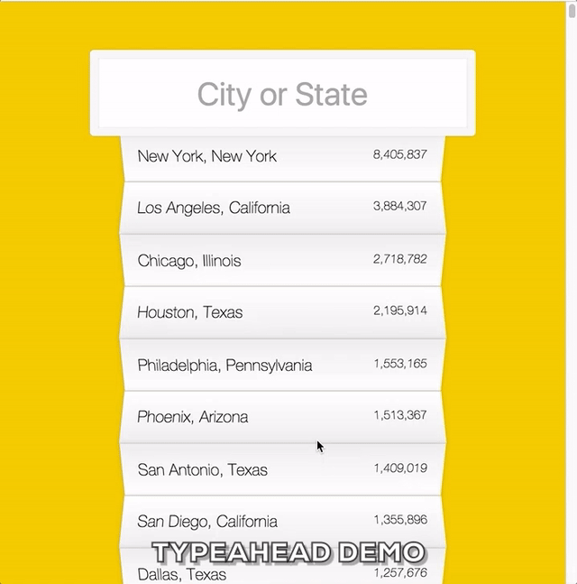

# 写在系列开篇
在学习了基本的 HTML / CSS / JavaScript 之后没有啥 side project 就直接开始学 Angular 做项目。遇到最近很火的[JavaScript30](https://JavaScript30.com)这个项目后决心好好实践一下 Vanilla JavaScript。

对于每个挑战，我会自己在看过视频了解原理后自己实现一遍并在 [blog](https://xg-wang.github.io/tags/JavaScript30/) 里记录过程、想法和相关资料。源码放在我的 [Github](https://github.com/xg-wang/JavaScript30)上，demo 通过 Github Pages 部署，点击[这里](https://xg-wang.github.io/JavaScript30/)或 Github 的 readme 中连接可以访问。

# Objective
实现一个 "typeahead"，按下输入字母后搜索缓存数据中匹配的条目并显示。同时高亮搜索的字符串。
<!-- more -->


> - [Demo](https://xg-wang.github.io/JavaScript30/06%20-%20Type%20Ahead/)
> - [Source](https://github.com/xg-wang/JavaScript30/blob/master/06%20-%20Type%20Ahead/index.html)

# Steps
1. ajax 请求数据并缓存；
2. 添加 keyup 和 change 事件监听器，搜索匹配的条目；
3. 修改添加 suggestions 的 innerHTML。

# Things Learned
## fetch API
[`fetch()`](https://developer.mozilla.org/en-US/docs/Web/API/WindowOrWorkerGlobalScope/fetch)是一个新引入的api，用于获取资源并返回一个 Promise 对象。fetch 可以直接接受一个 url 字符串，也可以接受一个 [Request](https://developer.mozilla.org/en-US/docs/Web/API/Request) 对象。

由于返回的是 Promise，可以使用 `.then()` 来处理返回值。

## change vs keyup
change 发生的时机是输入的 value 改变并 blur， keyup则是键盘按键松开即触发。

## typeahead 设计
搜索并利用 RegExp 替换还是很简单的，我用了 `filter` 和 `map`函数式会简练一点。
```
function update() {
  const searchStr = this.value.toUpperCase();
  suggestions.innerHTML = data
    .filter(place => 
      place.city.toUpperCase().includes(searchStr) || place.state.toUpperCase().includes(searchStr)
    )
    .map(place => {
      const regex = new RegExp(this.value, 'gi');
      const cityName = place.city.replace(regex, `<span class="hl">${this.value}</span>`);
      const stateName = place.state.replace(regex, `<span class="hl">${this.value}</span>`);    
      return `
        <li>
          <span class="name">${cityName}, ${stateName}</span>
          <span class="population">${numberWithCommas(place.population)}</span>
        </li>
      `; 
    })
    .join('');
}
```

## CSS
Wes 提供的默认 CSS 样式都很好看，这里学习了一下 suggestions 的实现：利用奇偶孩子设置变换角度等和背景的 `linear-gradient` 实现折叠效果。
```
.suggestions li:nth-child(even) {
  transform: perspective(100px) rotateX(3deg) translateY(2px) scale(1.001);
  background: linear-gradient(to bottom,  #ffffff 0%,#EFEFEF 100%);
}
.suggestions li:nth-child(odd) {
  transform: perspective(100px) rotateX(-3deg) translateY(3px);
  background: linear-gradient(to top,  #ffffff 0%,#EFEFEF 100%);
}
```

