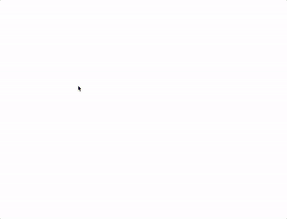

# 写在系列开篇
在学习了基本的 HTML / CSS / JavaScript 之后没有啥 side project 就直接开始学 Angular 做项目。遇到最近很火的[JavaScript30](https://JavaScript30.com)这个项目后决心好好实践一下 Vanilla JavaScript。

对于每个挑战，我会自己在看过视频了解原理后自己实现一遍并在 [blog](https://xg-wang.github.io/tags/JavaScript30/) 里记录过程、想法和相关资料。源码放在我的 [Github](https://github.com/xg-wang/JavaScript30)上，demo 通过 Github Pages 部署，点击[这里](https://xg-wang.github.io/JavaScript30/)或 Github 的 readme 中连接可以访问。

# Objective
实现一个简单的彩虹效果的 Canvas 画笔。
<!-- more -->


> - [Demo](https://xg-wang.github.io/JavaScript30/08%20-%20Fun%20with%20HTML5%20Canvas/)
> - [Source](https://github.com/xg-wang/JavaScript30/blob/master/08%20-%20Fun%20with%20HTML5%20Canvas/index.html)

# Steps
1. 获取 canvas 以及其 context 并设置初始属性；
2. 设置需要的4个事件(mouseup, mousedown, mouseout, mousemove)的监听器；
3. 在画图函数中设置 context 的状态并完成画图。

# Details and Things learned
`<canvas>` 可以完成图像的绘制，功能十分强大。MDN 有非常好的[教程](https://developer.mozilla.org/en-US/docs/Web/API/Canvas_API/Tutorial)，今天这个小 demo 只使用了 `<canvas>` 的线段绘制的一部分 API。

## Prepare
首先要获取元素以及 context：
```
const canvas = document.querySelector('#draw');
const ctx = canvas.getContext('2d');
```
这里我们只需要 2d 的绘制功能，如果需要绘制 3d 图形，可以 `getContext('webgl')`。

然后设置几个属性：
- ` ctx.strokeStyle = 'hsl(50, 100%, 50%)';` strokeStyle 可以设置 color, gradient, pattern
- ` ctx.lineJoin = 'round';` 指定画出的线段如何相交，提供了三种选项 
- ` ctx.lineCap = 'round';` 指定画出的线段端点如何截止，同样三种我们选择 round

- ` ctx.lineWidth = 10;` 画线段的宽度，in space units。

程序相关的
- `let isDrawing = false;` 用于标明是否处于绘图状态，在鼠标按下松开移出绘图区时更新。
- `let lastX, lastY;` 记录每次移动鼠标前点的位置，从而可以画出光滑曲线。
- `let hue = 0;` 使用 hsl 来表征颜色，从而可以得到连续的颜色变化。
- `let widthGrow = true;` 用来让宽度来回变大变小。

## 画图过程
canvas 可以画出多种图形以及 animation 等特效，最简单的花路径根据
[MDN 教程](https://developer.mozilla.org/en-US/docs/Web/API/Canvas_API/Tutorial/Drawing_shapes) 分为以下几步：
- `beginPath()` - 清空context的所有状态开始新的画图过程。
- `Path methods` - 操作画图的点的移动，包括 `moveTo()`, `lineTo()`, `bezierCurveTo()`, `quadraticCurveTo()`等等。
- `closePath()` - 结束 path 的规划，之后的指令重新对 context 起作用。
- `stroke()` - 画！
- `fill()` - 填充，这次没用到。
加入颜色，宽度调整后的完整代码：
```
canvas.addEventListener('mousemove', (e) => {
  if (!isDrawing) return false;
  ctx.strokeStyle = `hsl(${hue}, 100%, 50%)`; 
  ctx.beginPath();
  ctx.moveTo(lastX, lastY);
  ctx.lineTo(e.offsetX, e.offsetY);
  ctx.closePath();
  ctx.stroke();
  [lastX, lastY] = [e.offsetX, e.offsetY];
  hue = (hue + 1) % 360;
  if (ctx.lineWidth == 66 || ctx.lineWidth == 1) {
    widthGrow = !widthGrow;
  }
  ctx.lineWidth = ctx.lineWidth + (widthGrow ? 1 : -1);
})
```

## Notice
如果不使用 ` [lastX, lastY] = [e.offsetX, e.offsetY];`，每次画图的线似乎断断续续的，原因是每次只画一个点，而不是一段线。

## HSL
以前只会 RGBA 颜色表示，实际上 "Hue-saturation-lightness model (HSL)" 表示方法更为直观，hue 是 0 - 360 的数字，然后选择饱和度和亮度，可以方便的猜测出结果的颜色。[这个网站](http://hslpicker.com/)可以方便预览选取的颜色。
