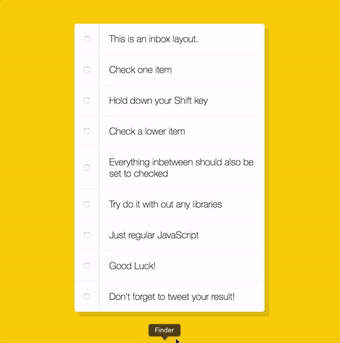

# Objective
实现按住 Shift 键点击 list 时批量选中。
<!-- more -->


> - [Demo](https://xg-wang.github.io/JavaScript30/10%20-%20Hold%20Shift%20and%20Check%20Checkboxes/)
> - [Source](https://github.com/xg-wang/JavaScript30/blob/master/10%20-%20Hold%20Shift%20and%20Check%20Checkboxes/index.html)

# Steps
1. 获取所有checkbox；
2. 第一遍扫描记录checked状态的最远的两个checkbox；
3. 第二遍扫描check之间的所有checkbox。

# Details and Things learned
## Basic
- `<input type="checkbox">` checked 状态通过 `checked` attribute 表示。
- shift 键是否按下通过 `event.shiftKey` 布尔值判断。
- 利用 JS 事件传播的特性，在所有 checkbox 的公共父元素上添加一个监听器即可处理所有点击事件。

## Logic
这一次Wes示范的实现存在bug：
```
function handleCheck(e) {
  // Check if they had the shift key down
  // AND check that they are checking it
  let inBetween = false;
  if (e.shiftKey && this.checked) {
    // go ahead and do what we please
    // loop over every single checkbox
    checkboxes.forEach(checkbox => {
      console.log(checkbox);
      if (checkbox === this || checkbox === lastChecked) {
        inBetween = !inBetween;
        console.log('STarting to check them inbetween!');
      }

      if (inBetween) {
        checkbox.checked = true;
      }
    });
  }

  lastChecked = this;
}
```
这样的实现如果直接 shift 点击会选中当前 checkbox 以及之后所有的。

为了解决这个 bug，我们可以扫描两边，第一遍记录最开始和最后的两个checkbox

```
document.querySelector('.inbox').addEventListener('click', e => {
  if (!e.shiftKey) return;
  let first, last;
  for (let cb of checkboxes) {
    if (cb.checked) {
      if (!first) first = cb;
      last = cb;
    }
  }
  let inBetween = false;
  for (let cb of checkboxes) {
    if (cb === first || cb === last) {
      inBetween = !inBetween;
      if (cb === first && cb === last) {
        inBetween = false;
      }
    }
    if (inBetween) cb.checked = true;
  }
});
```

在第二遍扫描时处理特殊情况：first 和 last 是同一个 checkbox。
